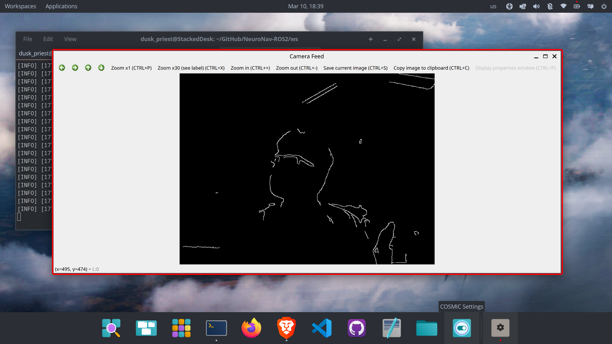
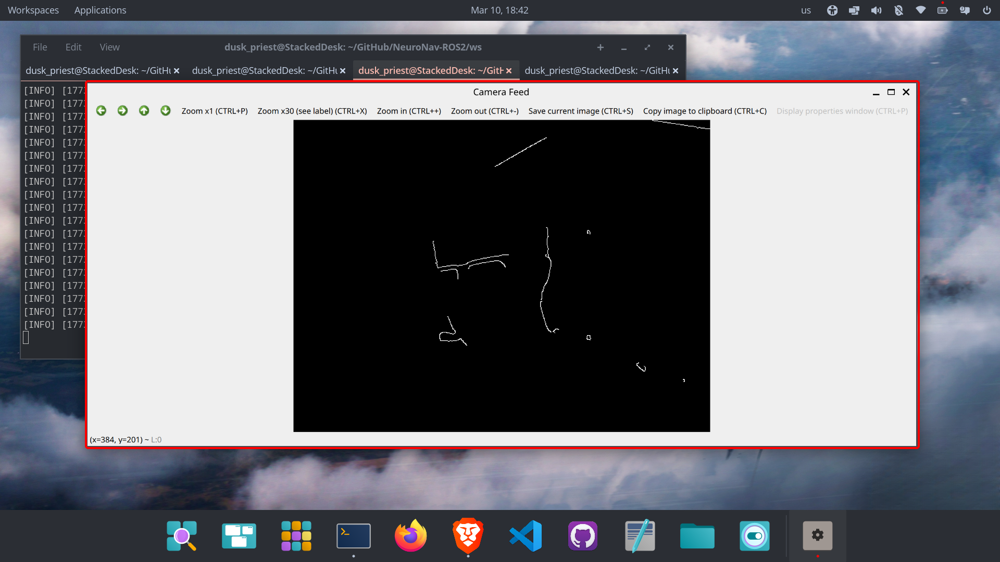
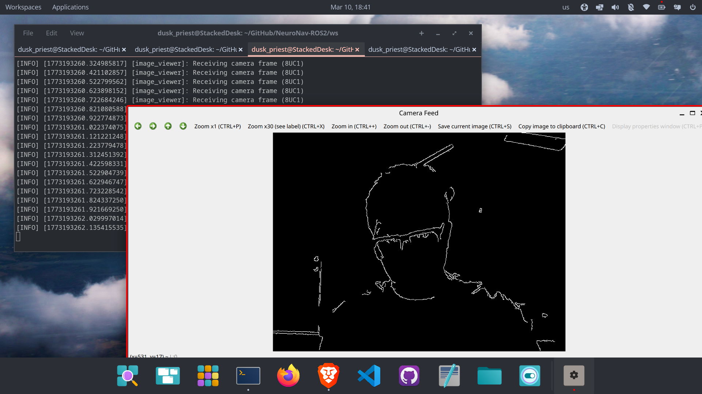

# Day 04: Parameterized Edge Detection (Canny)

Today the development environment had to be restored after an OS reinstall. 
The NeuroNav-ROS2 repository was cloned again and the ROS2 Jazzy environment 
was reinstalled. After rebuilding the workspace using `colcon build`, the 
existing perception pipeline from previous days was validated.

The following nodes were successfully restored:

camera_publisher → publishes webcam frames to /camera/image_raw  
edge_detector → processes frames using Canny edge detection  
image_viewer → visualizes both raw and processed image streams  

---

After confirming the pipeline worked again, the edge detector node was upgraded
to support runtime parameter tuning using ROS2 parameters.

Two parameters were introduced:

threshold1 — lower hysteresis threshold for Canny
threshold2 — upper hysteresis threshold for Canny

These parameters can now be set at launch time:

ros2 run nn_perception edge_detector --ros-args -p threshold1:=50 -p threshold2:=120

Three configurations were tested:

Low thresholds (50 / 120):
High sensitivity, many edges detected including noise.

Default thresholds (100 / 200):
Balanced edge detection with clear object boundaries.

High thresholds (150 / 300):
Only strong contours remain; background noise removed.

## Results

### Default thresholds (100 / 200)

### Low thresholds (50 / 120)

### High thresholds (150 / 300)

This experiment demonstrates how ROS2 parameters allow perception algorithms
to be tuned dynamically without modifying source code.

Outcome:
A fully functional ROS2 perception pipeline with adjustable edge detection.

---