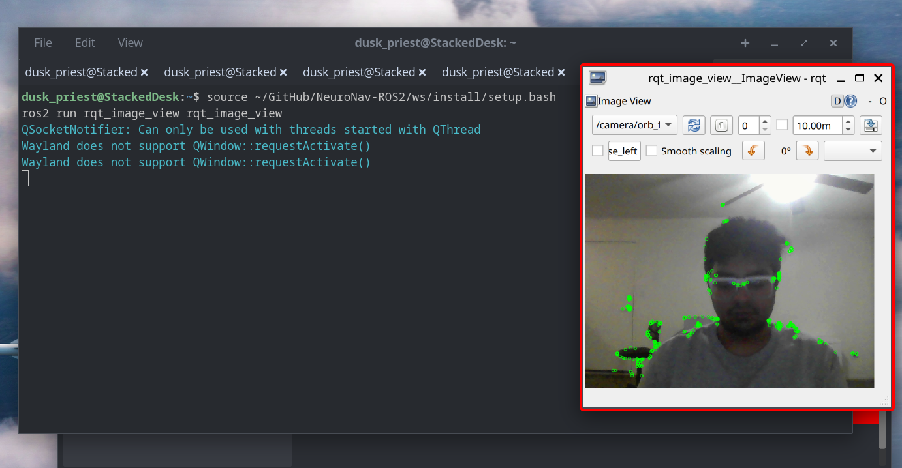

# Day 05: ORB Feature Detection

Today the perception pipeline was extended beyond edge detection by adding
a new feature extraction node based on the ORB algorithm.

A new node **orb_features** was created inside the `nn_perception` package.

The node performs the following steps:

camera_publisher → publishes webcam frames to /camera/image_raw  
orb_features → detects ORB keypoints on incoming frames  
rqt_image_view → visualizes the detected features  

---

The ORB node subscribes to:

```
/camera/image_raw
```

and publishes annotated frames to:

```
/camera/orb_features
```

ORB detects visually distinctive points such as corners and textured
regions in the image. These points are called **keypoints** and act as
visual landmarks that can later be used for feature matching and visual
odometry.

## Commands Used

Build the perception package:

```
colcon build --packages-select nn_perception
```

Run the camera publisher:

```
ros2 run nn_sensors camera_publisher
```

Run the ORB feature detector:

```
ros2 run nn_perception orb_features
```

Check running nodes:

```
ros2 node list
```

Check output rate:

```
ros2 topic hz /camera/orb_features
```

Visualize the detected features:

```
ros2 run rqt_image_view rqt_image_view
```

Select topic:

```
/camera/orb_features
```

## Result

ORB keypoints were successfully detected on live webcam frames.  
Green points appeared on corners, textures, and high contrast areas
such as fingers, hair edges, clothing folds, and background objects.

### ORB Feature Detection Output



This demonstrates that the perception pipeline can now extract stable
visual landmarks from the environment, which will be used for feature
matching and motion estimation in later stages.

Outcome:  
A working ROS2 perception node for real-time ORB feature extraction.

---