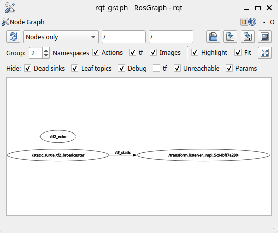

# Day 06: TF2 Static Transform Broadcasting

## Objective

Understand the fundamentals of TF2 in ROS2 by creating a static
transform broadcaster and verifying frame relationships between
coordinate frames.

---

## Key Concept

TF2 is the transform library used in ROS2 to track coordinate frame
relationships between different parts of a robotic system. It allows
robots to understand how sensors, actuators, and world frames relate
spatially.

Transforms define:

- translation (x, y, z).
- rotation (quaternion).

These relationships form a **frame tree** that robots use for
perception, navigation, and control.

## Package Created

```
learning_tf2_py
```

## Node Implemented

```
static_turtle_tf2_broadcaster
```

This node publishes a static transform between two frames:

```
world → mystaticturtle
```

Transform parameters:

Translation:

```
x = 1.0
y = 0.0
z = 0.0
```

Rotation:

```
Quaternion = (0, 0, 0, 1)
```

## Commands Used

### Create package

```
    ros2 pkg create --build-type ament_python learning_tf2_py --dependencies geometry_msgs python3-numpy rclpy tf2_ros_py turtlesim
```

### Build workspace

```
    colcon build
    source install/setup.bash
```

### Run static transform broadcaster

```
    ros2 run learning_tf2_py static_turtle_tf2_broadcaster
```

### Inspect transform

```
    ros2 run tf2_ros tf2_echo world mystaticturtle
```

### Inspect TF topic

```
    ros2 topic echo /tf_static --once
```

### Visualize ROS graph

```
    rqt_graph
```

## Observations

The static broadcaster successfully published a transform between the
`world` and `mystaticturtle` frames.

The `/tf_static` topic contains the transform message and is consumed by
TF listeners such as `tf2_echo`.

The ROS computation graph confirms the relationship:

```
static_turtle_tf2_broadcaster → /tf_static → TF listeners
```

## Asset



(Day 06 ROS Graph)

## Notes

Static transforms are used when the spatial relationship between two frames never changes.

Examples in real robots:

- camera frame → robot base.
- lidar frame → base_link.
- IMU frame → drone body.

Dynamic transforms will be implemented later for moving frames.

---