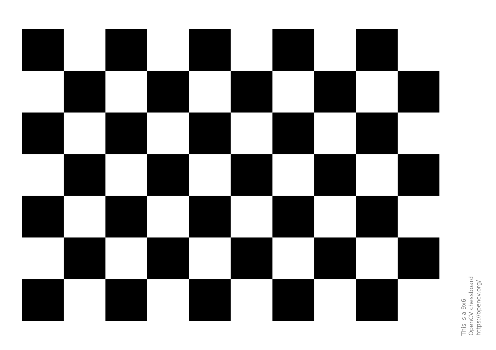

# Day 08: Camera Calibration

## Objective

Perform intrinsic calibration of a monocular camera in ROS2 using the
`camera_calibration` package and a checkerboard pattern.

------------------------------------------------------------------------

## Setup

### Camera node running

``` bash
ros2 run nn_sensors camera_publisher
```

### Image viewer

``` bash
ros2 run nn_sensors image_viewer
```

### Verify topics

``` bash
ros2 topic list
```

Expected:

```
    /camera/image_raw
    /camera/camera_info
```

## Install Calibration Tool

``` bash
sudo apt install ros-jazzy-camera-calibration
```

Verify installation:

``` bash
ros2 pkg executables camera_calibration
```

## Launch Calibration GUI

``` bash
ros2 run camera_calibration cameracalibrator --size 8x6 --square 0.025 --no-service-check --ros-args --remap image:=/camera/image_raw --remap camera:=/camera
```

## Asset

Calibration target used for ROS2 camera intrinsic calibration.



### Parameters

```
  Parameter         | Meaning
  ------------------|----------------------------
  size 8x6          |checkerboard inner corners
  square 0.025      |square size (meters)
  image topic       |camera image stream
  camera namespace  |camera node namespace
```

## Calibration Procedure

1.  Display checkerboard pattern.
2.  Move board across field of view.
3.  Vary position, distance, and tilt.
4.  Fill calibration coverage bars:
    - X
    - Y
    - Size
    - Skew

When coverage is sufficient:

-   Click **CALIBRATE**
-   Click **SAVE**

## Calibration Output

Saved file:

```
    /tmp/calibrationdata.tar.gz
```

Extracted file:

```
    ost.yaml
```

Moved to project:

```
    nn_sensors/ost.yaml
```

## Camera Intrinsic Parameters

Resolution: `640 × 480`

Intrinsic matrix:

```
 616.87    0.00  316.71
   0.00  616.26  255.87
   0.00    0.00    1.00
```

Distortion coefficients:

```
    k1 = -0.1515
    k2 = 0.3263
    p1 = -0.0027
    p2 = -0.0008
    k3 = 0.0000
```

## Key Concepts

-   Camera intrinsic matrix.
-   Lens distortion modeling.
-   Checkerboard corner detection.
-   ROS2 camera calibration pipeline.
-   YAML camera parameter storage.

## Outcome

Successfully calibrated webcam and obtained intrinsic parameters stored
in `ost.yaml` for future perception pipelines.

------------------------------------------------------------------------