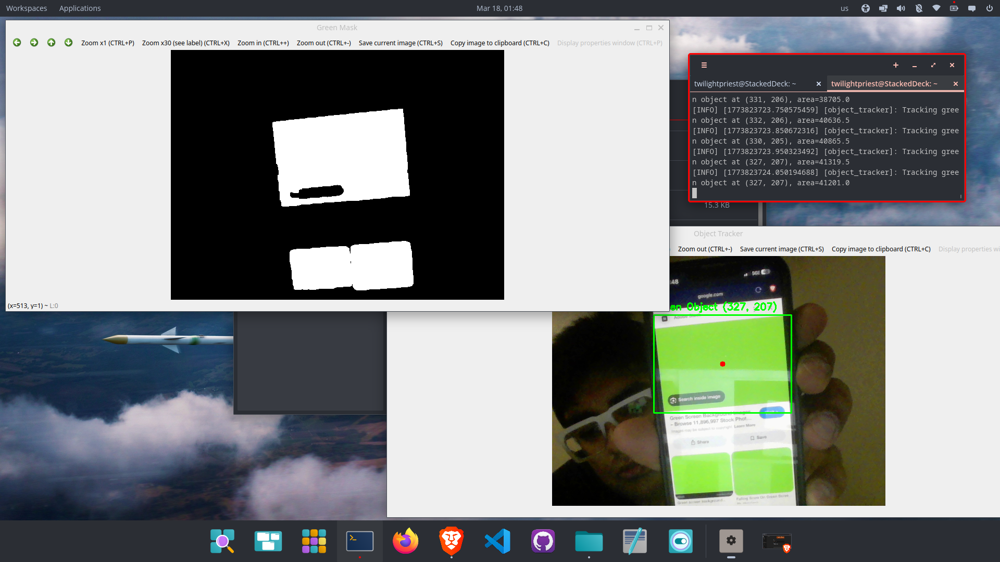

# Day 12: Object Tracking (First Perception Lock)

## Objective

Implement real-time object tracking using RGB input and classical computer vision techniques.

---

## System Setup

- ROS2 Jazzy workspace (NeuroNav-ROS2).
- RGB stream from `/camera/image_raw`.
- OpenCV-based processing pipeline.
- CvBridge for ROS ↔ OpenCV conversion.

## Pipeline

1. RGB image subscription.
2. BGR → HSV color space conversion.
3. Color segmentation (green mask).
4. Morphological filtering (erosion + dilation).
5. Contour detection.
6. Largest contour selection.
7. Bounding box + centroid estimation.

## Key Implementation

- HSV thresholding for green object isolation.
- Noise reduction via morphological operations.
- Area-based filtering to avoid false positives.
- Real-time visualization using OpenCV windows.

## Results

- Successfully detected and tracked a green object (mobile screen).
- Stable bounding box and centroid estimation.
- Consistent tracking across frames (~10 Hz pipeline).
- Clean binary mask separation.

## Observations

- HSV-based segmentation is sensitive to lighting conditions.
- Area thresholding significantly improves detection stability.
- System currently limited to color-based tracking (no semantics).

## Limitations

- No multi-object tracking.
- No depth awareness (2D tracking only).
- No persistence or ID tracking across frames.
- No ROS topic publishing of tracked coordinates.

## Key Takeaway

Transition from passive perception (image viewing) to active perception (object tracking).
The system now extracts structured information (position) from raw visual input.

## Next Steps

- Multi-color tracking.
- Publish (cx, cy) as ROS topic.
- Fuse with depth for 3D localization.
- Integrate into control loop (visual servoing).

## Status

Day 12 complete. First successful perception lock achieved.

---