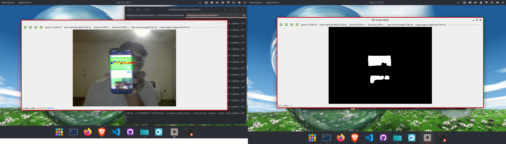

# Day 15: From Kalman to Extended Kalman (EKF)

Today marked a critical transition in my perception pipeline, moving from a classical Kalman Filter to a fully implemented Extended Kalman Filter (EKF) built from scratch.

---

I began by reconstructing the previous Day 14 Kalman tracking system after a repository reset. Instead of simply restoring functionality, I upgraded the model by introducing time-aware dynamics (Δt), making the motion model physically meaningful rather than assuming a fixed timestep.

From there, I designed a new EKF-based tracker node (`ekf_tracker.py`) without relying on OpenCV’s built-in Kalman filter. This involved explicitly defining:

- State vector: [x, y, vx, vy].
- Covariance propagation.
- Process and measurement noise models.
- Predict and update steps using linear algebra.

The system was integrated into the ROS2 pipeline, subscribing to live camera data and performing real-time object tracking using HSV-based segmentation.

## Final result:

- Measured position (noisy observation).
- Predicted state (model-based).
- Estimated state (fused belief).

All three were visualized simultaneously, clearly demonstrating the effect of Bayesian filtering in a real-world perception loop.

## Key Takeaways:

- Time consistency (Δt) significantly improves motion modeling.
- Building the filter manually provides full control over system assumptions.
- The EKF pipeline forms the foundation for future sensor fusion (e.g., RGB + depth).

This marks a shift from using estimation tools to actually engineering them.

---